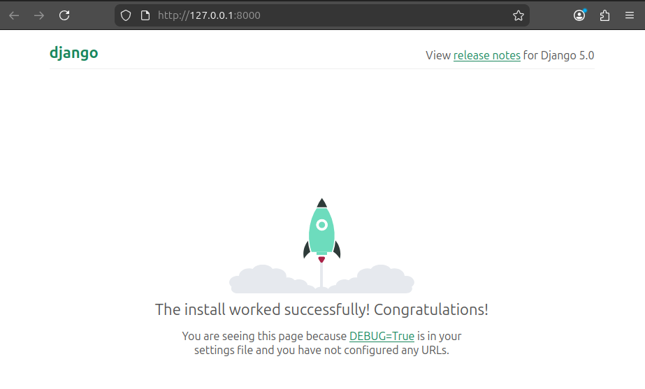

# Introduction to Django
Based on what I think they may ask me to do in my Amazon SDII exam, this is my quick (one-day-ish) self-introduction to Django...

Django is a tool (framework) that helps you build websites using Python. From a structural point of view, Django is based on **projects**, each project consisting on one or multiple **applications**.

Before getting started, it is recommended to set up a virtual environment. This provides an isolated space where you can install and manage all the dependencies needed for your project. We will obviously be installing Django.

#### Creating and activating an environment
1. You create an environment with `python -m venv my_env`. This creates a folder called `my_env`. Any Python libraries you install while your virtual environment is active will go into the `my_env/lib/python3.12/site-packages` directory.
2. Activate environment with `source my_env/bin/activate`. The shell prompt should now include the name of the active virtual environment enclosed in parentheses (e.g.,):
```
(my_env) drea@drea-pc:~/Documents/django$
```

#### Installing Django
For installing Django, just run this:
```
python -m pip install Django~=5.0.4
python -m django --version
```

Now we move into creating a project in Django.

## Creating a Django project
To create and start running the most basic Django project you need to do three things:
1. Make Django give you the basic files and settings you need for the project.
2. Connect default apps to their database tables.
3. Launch Django's integrated lightweight server to run your code.

### 1. Getting the basic project files and configs
Run the following command in your prompt shell:
```
django-admin startproject mysite
```
It will create a a `mysite/` folder with the following structure:
```
mysite/
    manage.py
    mysite/
        __init__.py
        asgi.py
        settings.py
        urls.py
        wsgi.py
```
You don't really need to touch the `manage.py` file. You endup just using it for three things:
1. Start the server: `python manage.py runserver`
2. Create apps: `python manage.py startapp app`
3. Run migrations: `python manage.py migrate`

The `mysite/` folder on the other hand, controls the whole website:
- The `__init__.py` basically tells Python to treat the whole `mysite/` as a Python package. This allows imports like `from mysite import settings`.
- The `asgi.py` and `wsgi.py` expose the Django application to a web server. `asgi.py`, allows the project to run as an ASGI (asynchronous) application with ASGI-compatible web servers (like Daphne or Uvicorn); `wsgi.py` allows to run the project as a Web Server Gateway Interface (WSGI) application with WSGI-compatible web servers (like Gunicorn ir uWSGI).
- The `urls.py` file maps URLs to Views (it's the router of the app)
- The `settings.py` file holds the global configuration. It defines database connections, installed apps, template settings, static files and middleware. It basically tells Django where to find each and how to use them. I have sectioned the `settings.py` file with comments to highlight these areas.

### 2. Connecting default apps to their database tables
If you go inside `settings.py`, you’ll find several important configuration options. Two of them are:
- `INSTALLED_APPS`: a list of Django applications that are included in your project by default. Many of these apps need a database to store and manage their data.
- `DATABASES`: this setting defines how your project connects to its database. By default, Django uses SQLite, a lightweight database that’s great for development. For production, it’s common to use a more robust database such as PostgreSQL, MySQL, or Oracle.

In Django, applications don’t interact with the database directly. Instead, they use models, which define the structure of your data. Each model is mapped to a database table.

The default Django project already includes the necessary models for its built-in apps. To create the corresponding database tables, you need to apply migrations by running:

```
cd mysite
python manage.py migrate
```

The command sets up the database and prepares it for use. It should create you a `db.sqlite3` file, and print you some output that looks like the following:

```
Applying contenttypes.0001_initial... OK
Applying auth.0001_initial... OK
Applying admin.0001_initial... OK
Applying admin.0002_logentry_remove_auto_add... OK
Applying admin.0003_logentry_add_action_flag_choices... OK
Applying contenttypes.0002_remove_content_type_name... OK
Applying auth.0002_alter_permission_name_max_length... OK
Applying auth.0003_alter_user_email_max_length... OK
Applying auth.0004_alter_user_username_opts... OK
Applying auth.0005_alter_user_last_login_null... OK
Applying auth.0006_require_contenttypes_0002... OK
Applying auth.0007_alter_validators_add_error_messages... OK
Applying auth.0008_alter_user_username_max_length... OK
Applying auth.0009_alter_user_last_name_max_length... OK
Applying auth.0010_alter_group_name_max_length... OK
Applying auth.0011_update_proxy_permissions... OK
Applying auth.0012_alter_user_first_name_max_length... OK
Applying sessions.0001_initial... OK
```

### 3. Launch Django's integrated lightweight server to run your code
Finally, Django comes with a lightweight web server to run the code (or changes to the code) quickly. To start such development server you must type the following:
```
python manage.py runserver
```

It will print some messages in the prompt:
```
Watching for file changes with StatReloader
Performing system checks...

System check identified no issues (0 silenced).
March 28, 2026 - 09:28:33
Django version 5.0.14, using settings 'mysite.settings'
Starting development server at http://127.0.0.1:8000/
Quit the server with CONTROL-C.
```
Grab the URL and open it in your browser. You should see something like this:



That is cool.