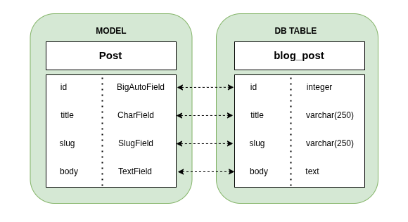
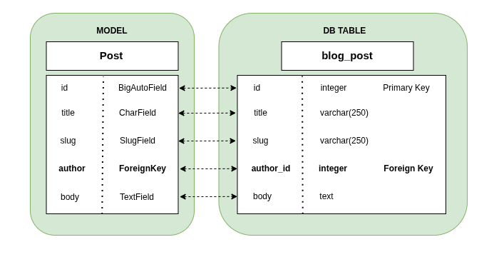

This is the README.md file for the new things I am adding on top of the blog app (otherwise the main one would get very saturated I think).

# The Blog App
When running 
```
python manage.py startapp blog
```
Django created a new `blog/` app folder. Inside `blog/apps.py` file it also defined a default `AppConfig` subclass:

```
from django.apps import AppConfig

class BlogConfig(AppConfig):
    default_auto_field = 'django.db.models.BigAutoField'
    name = 'blog'
```

The reason why it does this automatically is because you need this subclass in order to activate the app in your Django project.

To activate the app, you must take `blog.apps.BlogConfig` and add it to the `INSTALLED_APPS` setting in the `settings.py` file.  Once this is done, Django will know that the application is active for this project and that it can load the application models.

Let's now add a Model to our app.

## Creating a Post Model
To define a Django model, you define a Python class that subclasses a `django.db.models.Model`. Each Model maps to a single database table, where each attribute of the class represents a database field. 

Following a tutorial, now I'm going to add the following lines to the `blog/models.py`:

```
from django.db import models
class Post(models.Model):
    title = models.CharField(max_length=250)
    slug = models.SlugField(max_length=250)
    body = models.TextField()

    def __str__(self):
        return self.title
```
- `title`: This is the field for the post title. This is a `CharField` field, which translates into a `VARCHAR` column in the SQL database.
- `slug`: This is a `SlugField` field that translates into a `VARCHAR` column in the SQL datatabase. The slug is used to build pretty URLs for blog posts later on.
- `body`: This is a field to store the body of the post. It is a `TextField` field which translates into a `TEXT` column in the SQL database. 
- Finally, they added a `__str__()` method to the model class. This is helpful when trying to print the Model itself (make it human-readable somehow, when wanting to debug or state information about it). In this case, when called, it will print its title.



You can obviously keep adding fields to the class, as they do in the tutorial (see code).

### Adding a `Meta` class to the Post Model
In Django, a `Meta` class is an inner class inside your model that lets you configure how the model behaves (especially at the database level). You can have things like:
```
class Meta:
    ordering = ['-created_at']
```
which tells Django to sort the DB for the specific model in decreasing/descending order (`-`) of the variable `created-at`; or
```
class Meta:
    db_table = 'my_custom_table'
```
which overrides the default name of the table at the database with a custom name.
In our case, we use a `Meta` class to tell Django to 
(1) sort the table in the DB in desceding `-publish` order; and
(2) create an index table for `publish` to speed up the sorting

```
class Meta:
    ordering = ['-publish']
    indexes = [
        models.Index(fields=['-publish']),
    ]
```
### Adding a `Status` class and field
We are developing the Model for a Post. Posts can either be in progress (draft) or actually published. Therefore we create a new inner class inside the `Post` class called `Status`: 
```
class Status(models.TextChoices):
    DRAFT = 'DF', 'Draft'
    PUBLISHED = 'PB', 'Published'
```
Then add a `status` field of type `CharField`:
```
status = models.CharField(
    max_length=2,
    choices=Status,
    default=Status.DRAFT
)
``` 
The preceding code states:
- there is this `status` field which can take up at most 2 characters;
- the allowed set of charcters is limited to the ones from `Status`; and
- the default set of characters is `DF`.

Note the `Status` class is defined as a subclass of `models.TextChoices`. This allows us to call
- `Post.Status.choices` to obtain the available choices (`[('DF', 'Draft'), ('PB', 'Published')]`);
- `Post.Status.labels` to obtain the human-readable names (`['Draft', 'Published']`); and
- `Post.Status.values` to obtain the actual values of the choices (`['DF', 'PB']`).

### Using `ForeignKey` to build many-to-one relationships
Posts are always written by an author. Many posts can be written by the same author. This is called a many-to-one relationship. A `ForeignKey` in Django represents a relationship between two models, where one object belongs to another object.

With the following code in Post:
```
author = models.ForeignKey(
    settings.AUTH_USER_MODEL,
    ...
)
```
Django automatically creates another column in your table:



where the `author_id` matches the `User` model's ID. This is nice, as now you can type
`post.user` and Django:
- reads the `author_id`
- fetches the corresponding user from the database
- returns the `User` object

In the tutorial we see the following:
```
author = models.ForeignKey(
    settings.AUTH_USER_MODEL,
    on_delete=models.CASCADE,
    related_name='blog_posts'
)
```
The extra two lines allow you to:
(1) delete posts if the linked user is deleted; and 
(2) access an user’s posts using `user.blog_posts.all()`. Djando in the inside will 
- read the `author_id` associated to the post;
- use it to select the rows in `blog_post` where `author_id = user.id`

## Linking the Post Model to a database table
As explained before, there are two steps when linking a Model to a table in the database. First, you run 
```
python manage.py makemigrations blog
```
This is the output I get:
```
Migrations for 'blog':
  blog/migrations/0001_initial.py
    - Create model Post
```
The command creates the `0001_initial.py` file inside the `migrations/` directory of the blog application. 
This migration contains the SQL statements to create the database table for the Post model (or to update it, in case you have just modified a previously migrated file). You can actually check the SQL output of the migration by running the following:

```
python manage.py sqlmigrate blog 0001
```
which in my case returns:

```
BEGIN;
--
-- Create model Post
--
CREATE TABLE "blog_post" (
    "id" integer NOT NULL PRIMARY KEY AUTOINCREMENT, 
    "title" varchar(250) NOT NULL, 
    "slug" varchar(250) NOT NULL, "body" text NOT NULL, 
    "publish" datetime NOT NULL, 
    "created" datetime NOT NULL, 
    "updated" datetime NOT NULL, 
    "status" varchar(2) NOT NULL, 
    "author_id" integer NOT NULL REFERENCES 
    "auth_user" ("id") DEFERRABLE INITIALLY DEFERRED);
CREATE INDEX "blog_post_slug_b95473f2" ON "blog_post" ("slug");
CREATE INDEX "blog_post_author_id_dd7a8485" ON "blog_post" ("author_id");
CREATE INDEX "blog_post_publish_bb7600_idx" ON "blog_post" ("publish" DESC);
COMMIT;
```
Then you run 
```
python manage.py migrate
```
which applies migrations for all the applications listed in INSTALLED_APPS, including the blog application:
```
Operations to perform:
  Apply all migrations: admin, auth, blog, contenttypes, sessions
Running migrations:
  Applying blog.0001_initial... OK
``` 
For the blog application, it applies the `0001_initial.py` file. Now the database reflects the current status of the models (they're in sync).