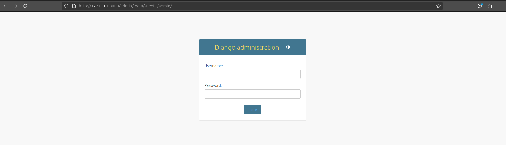
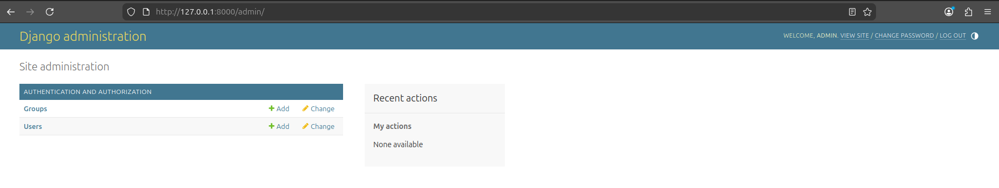
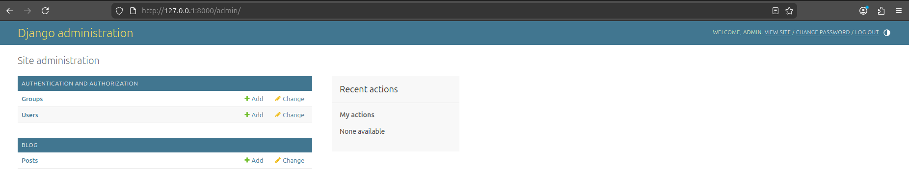

# Creating an administration site for the Post models

A Django project automatically comes with a built-in administration interface (app). This gets included with the `django.contrib.admin` setting in `INSTALLED_APPS`.

Therefore, when running
```
python manage.py runserver

Watching for file changes with StatReloader
Performing system checks...

System check identified no issues (0 silenced).
March 28, 2026 - 15:54:53
Django version 5.0.14, using settings 'mysite.settings'
Starting development server at http://127.0.0.1:8000/
Quit the server with CONTROL-C.
```
one can add `admin` to the URL, as follows

```
http://127.0.0.1:8000/admin/
```
and straighaway see the following screen:




Together with the `django.contrib.admin` setting, there's the `django.contrib.auth` app, which brings in the `User` and `Group` models. 

To manage the admin site, you first need to create an user. You can type the following:

```
python manage.py createsuperuser
```
You will need to fill-in some parameters:
```
Username (leave blank to use 'admin'): admin
Email address: admin@admin.com
Password: ********
Password (again): ********
```
Once you've successfully created an user, you can then launch the server and input your login details into `http://127.0.0.1:8000/admin/`. This will open up the administration site index page:



## Adding models to the administration site
To add our blog models to the administration site, we need to touch the `blog/admin.py` file:
```
from django.contrib import admin
from .models import Post

admin.site.register(Post)
```
By just reloading the administration site, we should see some changes:


## Customizing how models are displayed
The `blog/admin.py` file is also used to customize how models are displayed. 

I am going to skip going deep into this part because it is just display customization and I'm sure there are other more interesting things I can focus my time on right now.

Basically, you can customize the display with the following settings:
```
from django.contrib import admin
from .models import Post

@admin.register(Post)
class PostAdmin(admin.ModelAdmin):
    list_display = ['title', 'slug', 'author', 'publish', 'status']
    list_filter = ['status', 'created', 'publish', 'author']
    search_fields = ['title', 'body']
    prepopulated_fields = {'slug': ('title',)}
    raw_id_fields = ['author']
    date_hierarchy = 'publish'
    ordering = ['status', 'publish']
    show_facets = admin.ShowFacets.ALWAYS
```

